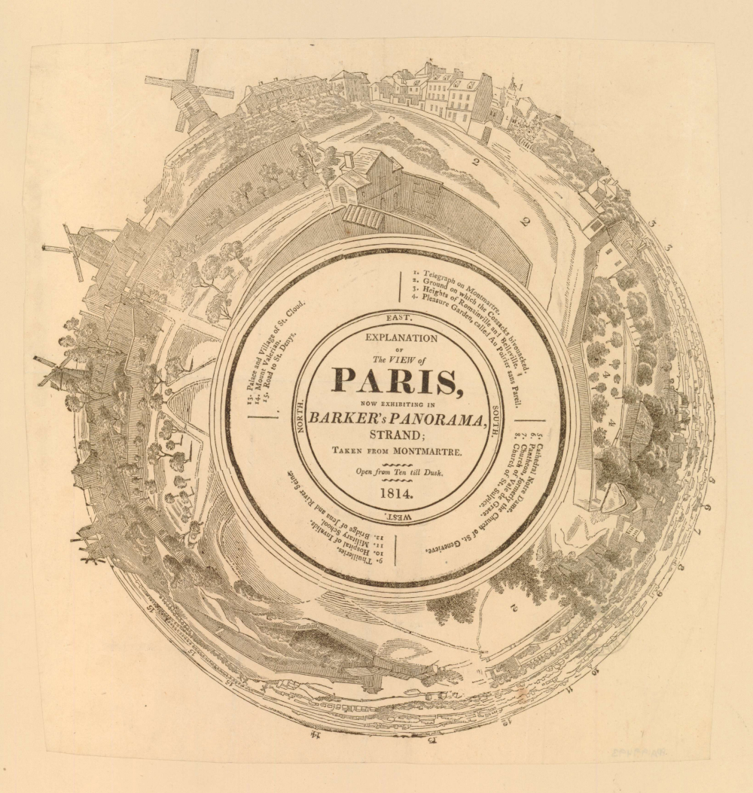
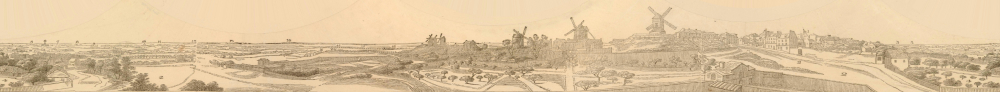
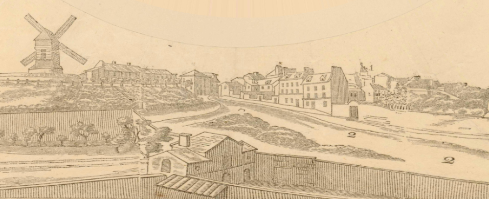
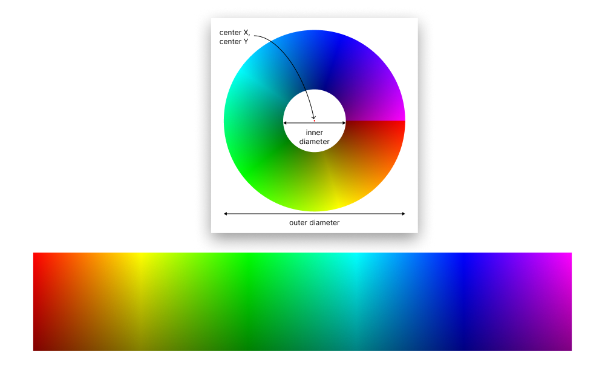

# anamorph-to-panorama

A small Rust script to convert circular anamorphic images into horizontal images.

## Example

Input Image: [_Explanation of the view of Paris_](https://www.britishmuseum.org/collection/object/P_1886-0111-23-13), created in 1814 (Museum Number: 1886,0111.23.13). From the British Museum, licensed under CC BY-NC-SA 4.0. 



Executed command:

```shell
./target/debug/anamorph-to-panorama ./input.jpg ./output-panorama.jpg 1730 1825 813 1925
```

Output Image:



Close up:



## Build

Assuming [Rust](https://www.rust-lang.org) is installed:

```shell
cargo build
```

## Usage

```shell
./target/debug/anamorph-to-panorama [INPUT_FILE] [OUTPUT_FILE] [center X] [center Y] [inner diameter] [outer diameter]
```

## Explanation

Below is a visual explanation of how the script works. It converts a 🍩 into a 🥖.  


